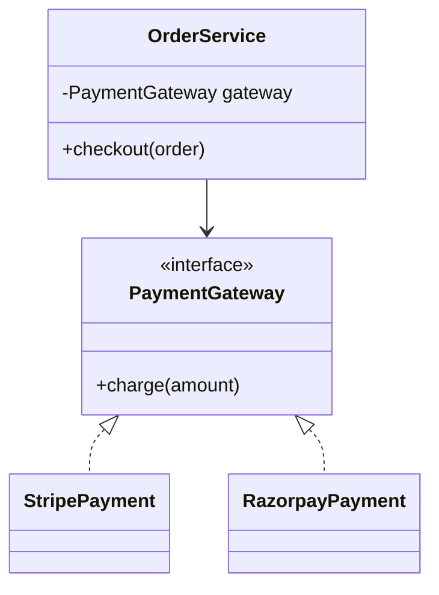

# LLD — Low-Level Design 🧩

OOP fundamentals, SOLID, design patterns, concurrency, and persistence, applied to 23 classic LLD problems. Part of the [root learning log](../README.md) — see there for the HLD counterpart.

---

## 🗣️ The LLD Answering Framework (use this every time, out loud)

LLD interviews test whether I can turn ambiguous requirements into maintainable classes, interfaces, and interactions — not whether I can recite the 23 GoF patterns. Talk out loud, don't jump straight to code.

1. **Clarify requirements & scope** — what actors/use cases matter, what's explicitly out of scope. Ask before modeling.
2. **Identify core objects & responsibilities** — nouns become candidate classes, verbs become candidate methods. Assign one clear responsibility per class (SRP).
3. **Define relationships** — association vs. aggregation vs. composition vs. dependency between the objects identified above.
4. **Apply relevant design pattern(s) — don't force-fit** — ask "what varies here?" (Strategy), "what state changes drive behavior?" (State), "who needs to react to changes?" (Observer), etc.
5. **Sketch class + sequence diagrams** — class diagram for structure, sequence diagram for the 1-2 most important interactions/flows.
6. **Extend & harden** — walk through "what if we add a new payment method / new vehicle type / new notification channel" without modifying existing classes (Open/Closed), then layer in concurrency, error handling, and persistence concerns if time allows.

> The pattern to internalize: `Concept → Small implementation → Design problem → Refactor → Production concerns` (add retry/idempotency/concurrency once the core design is solid).

---

## 📂 Directory Structure

```
LLD/
├── README.md                          ← you are here
├── concepts/                           ← Module B.1–B.5 — core fundamentals
│   ├── oop-fundamentals.md
│   ├── solid-principles.md
│   ├── object-relationships.md         ← association / aggregation / composition / dependency
│   ├── design-principles.md            ← DRY, KISS, YAGNI, LoD, Tell-Don't-Ask, etc.
│   └── uml-modeling.md                 ← class / sequence / state / activity / use-case diagrams
├── patterns/                           ← Module B.3 — design patterns
│   ├── creational.md                   ← Singleton, Factory, Abstract Factory, Builder, Prototype
│   ├── structural.md                   ← Adapter, Decorator, Facade, Proxy, Composite, Bridge, Flyweight
│   └── behavioral.md                   ← Strategy, Observer, State, Command, Chain of Responsibility, ...
├── production-concerns/                ← Module B.6–B.9 — beyond the whiteboard
│   ├── concurrency.md                  ← locks, mutex, semaphores, thread-safe singleton, producer/consumer
│   ├── error-handling-resilience.md    ← retry, timeout, circuit breaker, idempotency
│   ├── persistence-patterns.md         ← Repository, DAO, Unit of Work, Entity vs DTO
│   └── event-driven-design.md          ← Observer → Pub/Sub, Event Bus, dead-letter queues
├── case-studies/                       ← Module E — full mock-problem writeups
│   ├── beginner/
│   │   ├── parking-lot.md
│   │   ├── library-management.md
│   │   ├── tic-tac-toe.md
│   │   ├── chess.md
│   │   ├── elevator.md
│   │   ├── atm.md
│   │   ├── vending-machine.md
│   │   └── car-rental.md
│   ├── intermediate/
│   │   ├── splitwise.md
│   │   ├── movie-ticket-booking.md
│   │   ├── restaurant-reservation.md
│   │   ├── hotel-booking.md
│   │   ├── food-delivery.md
│   │   ├── ride-sharing.md
│   │   ├── notification-system.md
│   │   ├── logging-framework.md
│   │   ├── cache.md
│   │   └── rate-limiter.md
│   └── advanced/
│       ├── stock-exchange.md
│       ├── payment-system.md
│       ├── file-system.md
│       ├── distributed-task-scheduler.md
│       ├── message-queue.md
│       ├── workflow-engine.md
│       ├── rule-engine.md
│       ├── event-bus.md
│       ├── job-scheduler.md
│       └── llm-agent-framework.md      ← cross-reference HLD's topics/agent-systems/
├── diagrams/                           ← standalone/shared LLD diagrams
└── resources.md                        ← LLD-specific books, references
```

---

## 📊 Progress Tracker

### Module B.1 — OOP & Core Concepts

| Topic | Status | Notes |
|---|---|---|
| Classes, Objects, Encapsulation, Abstraction | ⬜ Not Started | |
| Inheritance vs. Composition | ⬜ Not Started | `Composition > Inheritance` — internalize this, it recurs constantly |
| Association, Aggregation, Dependency | ⬜ Not Started | Teacher-Student / Department-Professor / OrderService-PaymentService examples |
| Interfaces vs. Abstract Classes | ⬜ Not Started | |
| Method Overloading vs. Overriding | ⬜ Not Started | |
| Access Modifiers, Immutability | ⬜ Not Started | |
| Dependency Injection | ⬜ Not Started | Pull real examples from AI/backend work (provider abstractions) |

### Module B.2 — SOLID Principles

| Principle | Status | Notes |
|---|---|---|
| Single Responsibility | ⬜ Not Started | Learn with code, not definitions |
| Open/Closed | ⬜ Not Started | |
| Liskov Substitution | ⬜ Not Started | |
| Interface Segregation | ⬜ Not Started | |
| Dependency Inversion | ⬜ Not Started | High-level modules shouldn't depend on low-level implementations directly |

### Module B.3 — Design Patterns

| Pattern Family | Priority Order | Status | Notes |
|---|---|---|---|
| Creational | Factory → Builder → Singleton → Abstract Factory → Prototype | ⬜ Not Started | |
| Structural | Adapter → Decorator → Facade → Proxy → Composite | ⬜ Not Started | |
| Behavioral | Strategy → Observer → State → Command → Chain of Responsibility | ⬜ Not Started | These five appear constantly in practical designs — highest priority |

### Module B.4 — Beyond SOLID

| Topic | Status | Notes |
|---|---|---|
| DRY, KISS, YAGNI | ⬜ Not Started | |
| Separation of Concerns, Law of Demeter, Tell Don't Ask | ⬜ Not Started | |
| Program to an interface, Encapsulate what varies | ⬜ Not Started | |
| High cohesion / Low coupling | ⬜ Not Started | |

### Module B.5 — UML / Modeling

| Diagram Type | Status | Notes |
|---|---|---|
| Class diagrams | ⬜ Not Started | Most useful for LLD interviews, alongside sequence |
| Sequence diagrams | ⬜ Not Started | |
| State diagrams | ⬜ Not Started | Feeds directly into State Pattern practice |
| Activity / Use-case diagrams | ⬜ Not Started | Lower priority for interviews |

### Module B.6 — Concurrency

| Topic | Status | Notes |
|---|---|---|
| Thread safety, race conditions, locks/mutex/semaphores | ⬜ Not Started | High value for backend engineering |
| Thread-safe Singleton, double-checked locking | ⬜ Not Started | |
| Producer/Consumer, thread pools, deadlocks | ⬜ Not Started | |

### Module B.7 — Error Handling & Resilience

| Topic | Status | Notes |
|---|---|---|
| Exception hierarchy, validation, transaction boundaries | ⬜ Not Started | |
| Retry, timeout, circuit breaker, fallback | ⬜ Not Started | |
| Idempotency, rate limiting | ⬜ Not Started | Cross-reference HLD's `fundamentals/rate-limiting.md` for the algorithmic side |

### Module B.8 — Persistence Layer

| Topic | Status | Notes |
|---|---|---|
| Controller → Service → Repository → DB layering | ⬜ Not Started | |
| Repository, DAO, Unit of Work | ⬜ Not Started | |
| Entity vs. DTO, Domain Model, Caching | ⬜ Not Started | |

### Module B.9 — Event-Driven Design (LLD angle)

| Topic | Status | Notes |
|---|---|---|
| Observer pattern → Pub/Sub | ⬜ Not Started | |
| Event Bus, Event Handler, Consumer groups | ⬜ Not Started | |
| Idempotent consumers, dead-letter queues | ⬜ Not Started | Ties into `case-studies/advanced/event-bus.md` |

**Legend:** ⬜ Not Started · 🟨 In Progress · ✅ Done

**Practice for this module:** implement Strategy → Observer → State → Command with tiny code samples before touching a full LLD problem. Then run the 6-step framework out loud on 1-2 beginner problems (Parking Lot, Vending Machine) before moving to intermediate/advanced.

---

### Module E — Full LLD Mock Sessions (~30-40 min each, out loud, timed)

Run these with the 6-step framework above. Beginner problems first to build fluency, then intermediate/advanced with concurrency and persistence layered in.

| # | Prompt | Level | Status | Notes |
|---|---|---|---|---|
| 1 | Parking Lot | Beginner | ⬜ Not Started | Good for practicing Strategy (pricing) + Factory (spot allocation) |
| 2 | Library Management System | Beginner | ⬜ Not Started | |
| 3 | Tic-Tac-Toe | Beginner | ⬜ Not Started | |
| 4 | Elevator System | Beginner | ⬜ Not Started | Good State Pattern practice |
| 5 | ATM | Beginner | ⬜ Not Started | Good State + Command Pattern practice |
| 6 | Vending Machine | Beginner | ⬜ Not Started | |
| 7 | Car Rental System | Beginner | ⬜ Not Started | |
| 8 | Chess | Beginner/Intermediate | ⬜ Not Started | Good for Strategy (movement rules) + Memento (undo) |
| 9 | Splitwise | Intermediate | ⬜ Not Started | Common interview favorite — Strategy for split types |
| 10 | Movie Ticket Booking | Intermediate | ⬜ Not Started | Concurrency angle: seat locking |
| 11 | Restaurant Reservation | Intermediate | ⬜ Not Started | |
| 12 | Hotel Booking | Intermediate | ⬜ Not Started | |
| 13 | Food Delivery | Intermediate | ⬜ Not Started | |
| 14 | Ride Sharing | Intermediate | ⬜ Not Started | Bridges into HLD (matching, geo-indexing) |
| 15 | Notification System (LLD) | Intermediate | ⬜ Not Started | Compare with HLD's system-level version of the same system |
| 16 | Logging Framework | Intermediate | ⬜ Not Started | Good Chain of Responsibility practice |
| 17 | Cache | Intermediate | ⬜ Not Started | |
| 18 | Rate Limiter (LLD) | Intermediate | ⬜ Not Started | Compare with HLD's algorithmic treatment |
| 19 | Stock Exchange | Advanced | ⬜ Not Started | |
| 20 | Payment System | Advanced | ⬜ Not Started | Strategy (providers) + retry/idempotency/concurrency layer |
| 21 | File System | Advanced | ⬜ Not Started | Composite Pattern |
| 22 | Distributed Task Scheduler | Advanced | ⬜ Not Started | |
| 23 | Message Queue | Advanced | ⬜ Not Started | |
| 24 | Workflow Engine | Advanced | ⬜ Not Started | |
| 25 | Rule Engine | Advanced | ⬜ Not Started | |
| 26 | Event Bus | Advanced | ⬜ Not Started | |
| 27 | Job Scheduler | Advanced | ⬜ Not Started | |
| 28 | LLM Agent Framework | Advanced | ⬜ Not Started | **Directly my domain — model provider abstraction, tool registry, planner/evaluator.** Cross-reference HLD's `topics/agent-systems/` |

**Practice sequence for one problem, end to end:**

```text
Strategy Pattern
      ↓
Payment Strategy
      ↓
Design Payment System (6-step framework)
      ↓
Add new payment providers (Open/Closed check)
      ↓
Add retry + idempotency + concurrency
```

---

## 🖼️ Diagram Convention

All diagrams use [Mermaid](https://mermaid.js.org/) so they render directly on GitHub.



**Rules I follow for consistency:**
- `classDiagram` for structure, `sequenceDiagram` for interactions/timing, `stateDiagram-v2` for state machines.
- Interfaces/abstract classes marked `<<interface>>` / `<<abstract>>`.
- Composition uses `*--`, aggregation uses `o--`, dependency uses `..>`.
- Every case-study diagram is preceded by a one-line caption describing what it shows.

---

## 📝 Note Template — Concepts & Patterns

```markdown
## What problem does this solve?

## Core objects & responsibilities

## Relationships
(association / aggregation / composition / dependency between the core objects)

## Relevant pattern(s) and why
(what varies, what's the alternative to hard-coding this variation)

## Class diagram

## Sequence diagram (key interaction)

## Interview angle (what follow-up questions/extensions this invites)
```

## 📝 Note Template — Case Studies (6-step framework)

```markdown
## 1. Clarify Requirements & Scope
- Actors / use cases
- Explicitly out of scope

## 2. Core Objects & Responsibilities
| Class | Responsibility |
|---|---|

## 3. Relationships
(association / aggregation / composition / dependency between the classes above)

## 4. Design Patterns Applied
(which pattern, and what specifically it's solving — don't force-fit)

## 5. Class + Sequence Diagrams
(class diagram for structure, sequence diagram for the key flow)

## 6. Extend & Harden
- New requirement walk-through (does it require modifying existing classes?)
- Concurrency considerations
- Error handling / resilience considerations
- Persistence considerations (if applicable)

## Real project tie-in
(where relevant: link this design to actual production work)
```

---

## 📚 Resources

- *Head First Design Patterns* — Freeman & Robson
- *Design Patterns: Elements of Reusable Object-Oriented Software* — Gang of Four
- [Refactoring.Guru](https://refactoring.guru/design-patterns) — pattern-by-pattern reference with examples
- *Designing Data-Intensive Applications* — Martin Kleppmann (for the persistence/concurrency chapters)

---

⬅️ Back to [root README](../README.md) · ➡️ See [HLD README](../HLD/README.md)

*Last updated: Aug 19, 2026*
