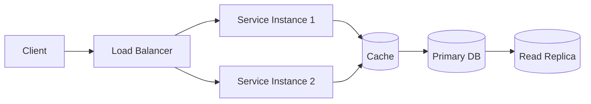

# System Design Learning Log 🧠📐

A personal, evolving repository where I document my system design learning journey — concepts, trade-offs, real-world case studies, and diagrams (all rendered natively in GitHub via Mermaid).

> **Why this repo exists:** to force myself to explain concepts in my own words, keep a searchable diagram archive, and track progress over time instead of losing notes across scattered docs.

---

## 📌 How to use this repo

- Each **topic** gets its own folder under `topics/` with a `README.md` (notes) and a `diagrams/` folder if the Mermaid diagrams get large.
- Each **case study** (e.g., "Design Twitter", "Design a Rate Limiter") lives under `case-studies/` with requirements → high-level design → deep dive → trade-offs.
- Diagrams are written in **Mermaid** directly inside markdown so they render on GitHub with zero external tools.
- Progress is tracked in the table below — updated as topics move from `Not Started` → `In Progress` → `Done`.

---

## 📂 Repository Structure

```
system-design/
├── README.md                  ← you are here
├── fundamentals/               ← core building blocks
│   ├── scalability.md
│   ├── availability.md
│   ├── consistency.md
│   ├── cap-theorem.md
│   └── load-balancing.md
├── topics/                     ← deep dives per component
│   ├── databases/
│   ├── caching/
│   ├── message-queues/
│   ├── api-design/
│   └── microservices/
├── case-studies/                ← end-to-end designs
│   ├── design-url-shortener.md
│   ├── design-rate-limiter.md
│   ├── design-chat-system.md
│   ├── design-news-feed.md
│   └── design-distributed-cache.md
├── diagrams/                    ← standalone/shared diagrams
└── resources.md                 ← books, courses, links
```

---

## 📊 Progress Tracker

### Fundamentals

| Topic | Status | Notes |
|---|---|---|
| Scalability (vertical vs horizontal) | ⬜ Not Started | |
| Availability & Reliability | ⬜ Not Started | |
| CAP Theorem | ⬜ Not Started | |
| Consistency Models | ⬜ Not Started | |
| Load Balancing | ⬜ Not Started | |
| Caching Strategies | ⬜ Not Started | |
| Database Indexing | ⬜ Not Started | |
| Sharding & Partitioning | ⬜ Not Started | |
| Replication | ⬜ Not Started | |
| Consistent Hashing | ⬜ Not Started | |
| Message Queues & Pub/Sub | ⬜ Not Started | |
| Rate Limiting | ⬜ Not Started | |
| CDN & Edge Caching | ⬜ Not Started | |

**Legend:** ⬜ Not Started · 🟨 In Progress · ✅ Done

### Case Studies

| Case Study | Status | Diagram |
|---|---|---|
| URL Shortener | ⬜ Not Started | — |
| Rate Limiter | ⬜ Not Started | — |
| Chat / Messaging System | ⬜ Not Started | — |
| News Feed System | ⬜ Not Started | — |
| Distributed Cache | ⬜ Not Started | — |
| Notification System | ⬜ Not Started | — |
| Ride-Sharing System (Uber-like) | ⬜ Not Started | — |
| Video Streaming (YouTube-like) | ⬜ Not Started | — |

---

## 🖼️ Diagram Convention

All diagrams use [Mermaid](https://mermaid.js.org/) so they render directly on GitHub. Example convention used throughout this repo:



**Rules I follow for consistency:**
- `flowchart LR` for request flows, `sequenceDiagram` for interaction/timing, `erDiagram` for data models.
- Databases and caches always shown as cylinders `[(...)]`.
- Every case-study diagram is preceded by a one-line caption describing what it shows.

---

## 📝 Note Template (used for every topic)

```markdown
## What problem does this solve?

## Key concepts

## Trade-offs
| Approach | Pros | Cons |
|---|---|---|

## Real-world examples

## Diagram

## Interview angle (questions this could show up in)
```

---

## 📚 Resources

- *Designing Data-Intensive Applications* — Martin Kleppmann
- *System Design Interview* Vol 1 & 2 — Alex Xu
- [High Scalability blog](http://highscalability.com/)
- Engineering blogs: Uber, Netflix, Airbnb, Discord, Meta
- [ByteByteGo](https://bytebytego.com/)

---

## 🎯 Goals

- [ ] Cover all fundamentals with my own notes + diagrams
- [ ] Complete 10+ end-to-end case studies
- [ ] Revisit and refine older notes as understanding deepens
- [ ] Use this repo actively during interview prep

---

*Last updated: Aug 19, 2026*
