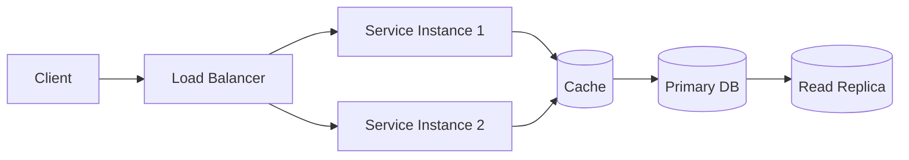
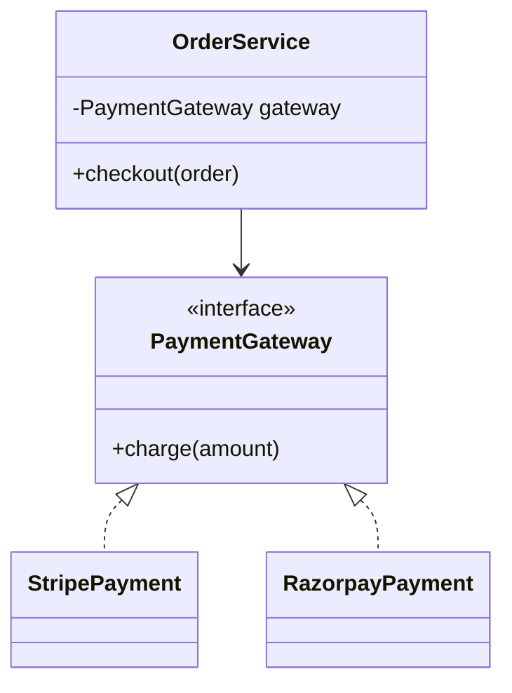

# System Design Learning Log 🧠📐

A personal, evolving repository where I document my system design and low-level design (LLD) learning journey — concepts, trade-offs, real-world case studies, and diagrams (all rendered natively in GitHub via Mermaid).

> **Why this repo exists:** to force myself to explain concepts in my own words, keep a searchable diagram archive, and track progress over time instead of losing notes across scattered docs. This repo follows a structured curriculum (below) built specifically for an AI Engineer background — classic system design (HLD) and low-level design (LLD) fundamentals first, then ML/AI-specific patterns where my actual production experience becomes the differentiator.

---

## 📌 How to use this repo

- Each **topic** gets its own folder under `topics/` with a `README.md` (notes) and a `diagrams/` folder if the Mermaid diagrams get large.
- Each **case study** (HLD, e.g., "Design Twitter", or LLD, e.g., "Design a Parking Lot") lives under `case-studies/` with requirements → design → deep dive → trade-offs.
- Diagrams are written in **Mermaid** directly inside markdown so they render on GitHub with zero external tools.
- Progress is tracked in the tables below — updated as topics move from `Not Started` → `In Progress` → `Done`.
- Every case study is practiced **out loud, timed**, using the relevant framework below (5-step for HLD, 6-step for LLD) — not just read and filed away.

---

## 🗣️ The HLD Answering Framework (use this every time, out loud)

A repeatable structure to avoid freezing on an open-ended system design prompt.

1. **Clarify requirements (2-3 min)** — functional (what must it do) and non-functional (scale, latency, consistency needs). Ask questions before designing anything.
2. **Estimate scale (back-of-envelope)** — users, requests/sec, data volume, storage growth. Rough numbers, stated out loud.
3. **High-level design** — draw the major components and how data flows between them, before any detail.
4. **Deep dive** — go deep on the 1-2 components an interviewer would steer toward (this is where AI-specific knowledge becomes the differentiator).
5. **Trade-offs and bottlenecks** — name what I'd reconsider at 10x scale, what could fail, and how I'd detect/recover.

> Practice saying *"I don't know the exact number, but I'd estimate roughly X because Y"* out loud — estimation confidence matters more than precision.

---

## 🧩 The LLD Answering Framework (use this every time, out loud)

LLD interviews test whether I can turn ambiguous requirements into maintainable classes, interfaces, and interactions — not whether I can recite the 23 GoF patterns. A different framework, same discipline: talk out loud, don't jump straight to code.

1. **Clarify requirements & scope** — what actors/use cases matter, what's explicitly out of scope. Ask before modeling.
2. **Identify core objects & responsibilities** — nouns become candidate classes, verbs become candidate methods. Assign one clear responsibility per class (SRP).
3. **Define relationships** — association vs. aggregation vs. composition vs. dependency between the objects identified above.
4. **Apply relevant design pattern(s) — don't force-fit** — ask "what varies here?" (Strategy), "what state changes drive behavior?" (State), "who needs to react to changes?" (Observer), etc.
5. **Sketch class + sequence diagrams** — class diagram for structure, sequence diagram for the 1-2 most important interactions/flows.
6. **Extend & harden** — walk through "what if we add a new payment method / new vehicle type / new notification channel" without modifying existing classes (Open/Closed), then layer in concurrency, error handling, and persistence concerns if time allows.

> The pattern to internalize: `Concept → Small implementation → Design problem → Refactor → Production concerns` (add retry/idempotency/concurrency once the core design is solid).

---

## 📂 Repository Structure

```
system-design/
├── README.md                        ← you are here (curriculum + tracker)
├── fundamentals/                     ← Module A — classic system design (HLD)
│   ├── scalability.md
│   ├── availability.md
│   ├── consistency.md
│   ├── cap-theorem.md
│   ├── load-balancing.md
│   ├── caching.md
│   ├── databases-indexing-sharding-replication.md
│   ├── message-queues.md
│   ├── api-design-rest-vs-graphql.md
│   ├── rate-limiting.md
│   └── consistent-hashing.md
├── lld/                               ← Module B — low-level design (LLD)
│   ├── oop-fundamentals.md
│   ├── solid-principles.md
│   ├── object-relationships.md        ← association / aggregation / composition / dependency
│   ├── design-principles.md           ← DRY, KISS, YAGNI, LoD, Tell-Don't-Ask, etc.
│   ├── uml-modeling.md                ← class / sequence / state / activity / use-case diagrams
│   ├── patterns/
│   │   ├── creational.md              ← Singleton, Factory, Abstract Factory, Builder, Prototype
│   │   ├── structural.md              ← Adapter, Decorator, Facade, Proxy, Composite, Bridge, Flyweight
│   │   └── behavioral.md              ← Strategy, Observer, State, Command, Chain of Responsibility, ...
│   ├── state-machines.md
│   ├── concurrency.md                 ← locks, mutex, semaphores, thread-safe singleton, producer/consumer
│   ├── error-handling-resilience.md   ← retry, timeout, circuit breaker, idempotency
│   └── persistence-patterns.md        ← Repository, DAO, Unit of Work, Entity vs DTO
├── topics/                            ← Module C — ML/AI-specific patterns (HLD)
│   ├── model-serving/
│   ├── rag-systems/
│   ├── feature-stores/
│   ├── ab-testing-experimentation/
│   ├── agent-systems/
│   ├── ml-observability-drift/
│   └── data-pipelines-for-ml/
├── case-studies/
│   ├── classic/                        ← Module D — full HLD mock-interview writeups
│   │   ├── design-url-shortener.md
│   │   ├── design-rate-limiter.md
│   │   └── design-notification-system.md
│   ├── ai-ml/                          ← Module D — AI/ML HLD writeups
│   │   ├── design-rag-fintech-chatbot.md
│   │   ├── design-fraud-detection-system.md
│   │   ├── design-model-serving-platform.md
│   │   ├── design-agentic-compliance-review.md
│   │   ├── design-recommendation-system.md
│   │   ├── design-feature-store.md
│   │   └── design-model-drift-monitoring.md
│   └── lld/                            ← Module E — LLD problem writeups
│       ├── beginner/
│       │   ├── parking-lot.md
│       │   ├── library-management.md
│       │   ├── tic-tac-toe.md
│       │   ├── chess.md
│       │   ├── elevator.md
│       │   ├── atm.md
│       │   ├── vending-machine.md
│       │   └── car-rental.md
│       ├── intermediate/
│       │   ├── splitwise.md
│       │   ├── movie-ticket-booking.md
│       │   ├── restaurant-reservation.md
│       │   ├── hotel-booking.md
│       │   ├── food-delivery.md
│       │   ├── ride-sharing.md
│       │   ├── notification-system.md
│       │   ├── logging-framework.md
│       │   ├── cache.md
│       │   └── rate-limiter.md
│       └── advanced/
│           ├── stock-exchange.md
│           ├── payment-system.md
│           ├── file-system.md
│           ├── distributed-task-scheduler.md
│           ├── message-queue.md
│           ├── workflow-engine.md
│           ├── rule-engine.md
│           ├── event-bus.md
│           ├── job-scheduler.md
│           └── llm-agent-framework.md   ← ties directly into agent-systems/ (Module C)
├── diagrams/                          ← standalone/shared diagrams
└── resources.md                       ← books, courses, links
```

---

## 📊 Progress Tracker

### Module A — Classic System Design Fundamentals (Weeks 1-2)

These underpin every ML system design question, so they get solid first, before layering AI-specific patterns on top.

| Topic | Status | Notes |
|---|---|---|
| Scaling (horizontal vs. vertical, load balancers, stateless services) | ⬜ Not Started | Tie to real Lambda/serverless architecture example |
| Databases (SQL vs. NoSQL, indexing, sharding, replication, read replicas) | ⬜ Not Started | |
| Caching (client/CDN/app/DB layers, invalidation, Redis basics) | ⬜ Not Started | |
| CAP Theorem (consistency vs. availability under partition) | ⬜ Not Started | Practice framing: compliance flag system → consistency; recommendation feed → availability |
| Message Queues (Kafka/SQS-style async decoupling) | ⬜ Not Started | Named gap area — prioritize |
| API Design (REST vs. GraphQL trade-offs) | ⬜ Not Started | Named gap area — prioritize |
| Rate Limiting (token bucket, sliding window) | ⬜ Not Started | Common standalone question |
| Consistent Hashing (distributed caching, sharding) | ⬜ Not Started | Common deep-dive topic |

**Legend:** ⬜ Not Started · 🟨 In Progress · ✅ Done

**Practice for this module:** pick 3 classic prompts (URL shortener, rate limiter, notification system) and run the HLD 5-step framework out loud, timed to ~20 minutes each.

---

### Module B — Low-Level Design (LLD) Fundamentals (Weeks 2-3)

The goal here isn't memorizing 23 GoF patterns — it's being fluent enough to turn a vague prompt into classes, interfaces, and interactions on a whiteboard, out loud, under time pressure.

#### B.1 — OOP & Core Concepts

| Topic | Status | Notes |
|---|---|---|
| Classes, Objects, Encapsulation, Abstraction | ⬜ Not Started | |
| Inheritance vs. Composition | ⬜ Not Started | `Composition > Inheritance` — internalize this, it recurs constantly |
| Association, Aggregation, Dependency | ⬜ Not Started | Teacher-Student / Department-Professor / OrderService-PaymentService examples |
| Interfaces vs. Abstract Classes | ⬜ Not Started | |
| Method Overloading vs. Overriding | ⬜ Not Started | |
| Access Modifiers, Immutability | ⬜ Not Started | |
| Dependency Injection | ⬜ Not Started | Pull real examples from AI/backend work (provider abstractions) |

#### B.2 — SOLID Principles

| Principle | Status | Notes |
|---|---|---|
| Single Responsibility | ⬜ Not Started | Learn with code, not definitions |
| Open/Closed | ⬜ Not Started | |
| Liskov Substitution | ⬜ Not Started | |
| Interface Segregation | ⬜ Not Started | |
| Dependency Inversion | ⬜ Not Started | High-level modules shouldn't depend on low-level implementations directly |

#### B.3 — Design Patterns

| Pattern Family | Priority Order | Status | Notes |
|---|---|---|---|
| Creational | Factory → Builder → Singleton → Abstract Factory → Prototype | ⬜ Not Started | |
| Structural | Adapter → Decorator → Facade → Proxy → Composite | ⬜ Not Started | |
| Behavioral | Strategy → Observer → State → Command → Chain of Responsibility | ⬜ Not Started | These five appear constantly in practical designs — highest priority |

#### B.4 — Beyond SOLID

| Topic | Status | Notes |
|---|---|---|
| DRY, KISS, YAGNI | ⬜ Not Started | |
| Separation of Concerns, Law of Demeter, Tell Don't Ask | ⬜ Not Started | |
| Program to an interface, Encapsulate what varies | ⬜ Not Started | |
| High cohesion / Low coupling | ⬜ Not Started | |

#### B.5 — UML / Modeling

| Diagram Type | Status | Notes |
|---|---|---|
| Class diagrams | ⬜ Not Started | Most useful for LLD interviews, alongside sequence |
| Sequence diagrams | ⬜ Not Started | |
| State diagrams | ⬜ Not Started | Feeds directly into State Pattern practice |
| Activity / Use-case diagrams | ⬜ Not Started | Lower priority for interviews |

#### B.6 — Concurrency

| Topic | Status | Notes |
|---|---|---|
| Thread safety, race conditions, locks/mutex/semaphores | ⬜ Not Started | High value for backend engineering |
| Thread-safe Singleton, double-checked locking | ⬜ Not Started | |
| Producer/Consumer, thread pools, deadlocks | ⬜ Not Started | |

#### B.7 — Error Handling & Resilience

| Topic | Status | Notes |
|---|---|---|
| Exception hierarchy, validation, transaction boundaries | ⬜ Not Started | |
| Retry, timeout, circuit breaker, fallback | ⬜ Not Started | |
| Idempotency, rate limiting | ⬜ Not Started | Overlaps with Module A rate limiting notes |

#### B.8 — Persistence Layer

| Topic | Status | Notes |
|---|---|---|
| Controller → Service → Repository → DB layering | ⬜ Not Started | |
| Repository, DAO, Unit of Work | ⬜ Not Started | |
| Entity vs. DTO, Domain Model, Caching | ⬜ Not Started | |

#### B.9 — Event-Driven Design (LLD angle)

| Topic | Status | Notes |
|---|---|---|
| Observer pattern → Pub/Sub | ⬜ Not Started | |
| Event Bus, Event Handler, Consumer groups | ⬜ Not Started | |
| Idempotent consumers, dead-letter queues | ⬜ Not Started | Ties into `case-studies/lld/advanced/event-bus.md` |

**Legend:** ⬜ Not Started · 🟨 In Progress · ✅ Done

**Practice for this module:** implement Strategy → Observer → State → Command with tiny code samples before touching a full LLD problem. Then run the LLD 6-step framework out loud on 1-2 beginner problems (Parking Lot, Vending Machine) before moving to `case-studies/lld/`.

---

### Module C — ML/AI-Specific System Design Patterns (Weeks 4-5)

This is where real production AI experience becomes a genuine advantage — most system-design candidates don't have this depth. Lean in hard once HLD + LLD fundamentals are solid.

| Topic | Status | Notes |
|---|---|---|
| Model Serving Infra (batch vs. real-time, versioning/rollback, autoscaling, GPU vs. CPU) | ⬜ Not Started | Reuse real MLOps answers |
| RAG System Design (ingestion → chunking → embedding → vector store → retrieval → reranking → generation → caching) | ⬜ Not Started | Can speak to every stage already |
| Feature Stores (train/serve skew prevention, online vs. offline) | ⬜ Not Started | |
| A/B Testing / Experimentation (shadow deployment, canary rollout) | ⬜ Not Started | Reuse real MLOps language |
| Agent System Design (orchestration, state management, guardrails, escalation) | ⬜ Not Started | **Strongest differentiator — reuse FinCrime architecture answers directly.** Also the natural bridge to LLD's `llm-agent-framework.md` case study (Planner / Memory / ToolRegistry / ToolExecutor / Evaluator as classes) |
| ML Monitoring/Observability (drift detection, latency percentiles, model dashboards) | ⬜ Not Started | Overlaps with escalation-rate/override-rate work |
| Data Pipeline Design for ML (batch training, streaming feature updates, backfill) | ⬜ Not Started | |

**Practice for this module:** take 3-4 of the AI/ML mock prompts below and run the same HLD 5-step framework, but explicitly pull in real project experience during the deep-dive step. For the LLM Agent Framework prompt specifically, pair the HLD framework with the LLD 6-step framework — sketch the class/interface abstractions (Model Provider, Retriever, Tool, ToolRegistry) as well as the system architecture.

---

### Module D — Full HLD Mock Sessions (~45 min each, out loud, timed)

| # | Prompt | Type | Status | Notes |
|---|---|---|---|---|
| 1 | Design a RAG-based customer support chatbot for a fintech company, serving 100k users | AI/ML | ⬜ Not Started | |
| 2 | Design a real-time fraud/anomaly detection system for financial transactions | AI/ML | ⬜ Not Started | Very close to real FinCrime work — should feel familiar |
| 3 | Design a model-serving platform supporting batch + real-time inference for multiple ML teams | AI/ML | ⬜ Not Started | |
| 4 | Design an agentic system that automates document review for compliance, with human-in-the-loop escalation | AI/ML | ⬜ Not Started | Directly my domain |
| 5 | Design a recommendation system for a content platform | AI/ML | ⬜ Not Started | Classic ML system design — tests Module A + C together |
| 6 | Design a feature store for a company running multiple ML models in production | AI/ML | ⬜ Not Started | |
| 7 | Design a system to detect and monitor model drift across 50+ deployed models | AI/ML | ⬜ Not Started | |
| 8 | Design a URL shortener | Classic | ⬜ Not Started | |
| 9 | Design a rate limiter | Classic | ⬜ Not Started | |
| 10 | Design a notification system | Classic | ⬜ Not Started | |

> If possible, do 2-3 of these with a friend or mock-interview partner playing interviewer — the real skill being tested is communicating thinking under ambiguity, not just having the answer.

---

### Module E — Full LLD Mock Sessions (~30-40 min each, out loud, timed)

Run these with the **LLD 6-step framework**. Beginner problems first to build fluency, then intermediate/advanced with concurrency and persistence layered in.

| # | Prompt | Level | Status | Notes |
|---|---|---|---|---|
| 1 | Parking Lot | Beginner | ⬜ Not Started | Classic entry point — good for practicing Strategy (pricing) + Factory (spot allocation) |
| 2 | Library Management System | Beginner | ⬜ Not Started | |
| 3 | Tic-Tac-Toe | Beginner | ⬜ Not Started | |
| 4 | Elevator System | Beginner | ⬜ Not Started | Good State Pattern practice |
| 5 | ATM | Beginner | ⬜ Not Started | Good State + Command Pattern practice |
| 6 | Vending Machine | Beginner | ⬜ Not Started | |
| 7 | Car Rental System | Beginner | ⬜ Not Started | |
| 8 | Chess | Beginner/Intermediate | ⬜ Not Started | Good for Strategy (movement rules) + Memento (undo) |
| 9 | Splitwise | Intermediate | ⬜ Not Started | Common interview favorite — Strategy for split types |
| 10 | Movie Ticket Booking | Intermediate | ⬜ Not Started | Concurrency angle: seat locking |
| 11 | Restaurant Reservation | Intermediate | ⬜ Not Started | |
| 12 | Hotel Booking | Intermediate | ⬜ Not Started | |
| 13 | Ride Sharing | Intermediate | ⬜ Not Started | Bridges into HLD (matching, geo-indexing) |
| 14 | Notification System (LLD) | Intermediate | ⬜ Not Started | Compare LLD class design vs. Module A's HLD version of the same system |
| 15 | Rate Limiter (LLD) | Intermediate | ⬜ Not Started | Compare LLD class design vs. Module A's algorithmic treatment |
| 16 | Logging Framework | Intermediate | ⬜ Not Started | Good Chain of Responsibility practice |
| 17 | Distributed Cache | Intermediate/Advanced | ⬜ Not Started | |
| 18 | Payment System | Advanced | ⬜ Not Started | Strategy (providers) + retry/idempotency/concurrency layer |
| 19 | File System | Advanced | ⬜ Not Started | Composite Pattern |
| 20 | Distributed Task Scheduler | Advanced | ⬜ Not Started | |
| 21 | Message Queue | Advanced | ⬜ Not Started | |
| 22 | Workflow / Rule Engine | Advanced | ⬜ Not Started | |
| 23 | LLM Agent Framework | Advanced | ⬜ Not Started | **Directly my domain — model provider abstraction, tool registry, planner/evaluator.** Cross-reference Module C's agent-systems/ notes |

**Practice sequence for one problem, end to end:**

```text
Strategy Pattern
      ↓
Payment Strategy
      ↓
Design Payment System (LLD 6-step framework)
      ↓
Add new payment providers (Open/Closed check)
      ↓
Add retry + idempotency + concurrency
```

---

## 🖼️ Diagram Convention

All diagrams use [Mermaid](https://mermaid.js.org/) so they render directly on GitHub. Two families of diagrams live in this repo:

**HLD (system/component flow):**



**LLD (class relationships):**



**Rules I follow for consistency:**
- `flowchart LR` for HLD request flows, `sequenceDiagram` for interaction/timing, `erDiagram` for data models, `classDiagram` for LLD structure, `stateDiagram-v2` for state machines.
- Databases and caches always shown as cylinders `[(...)]` in flowcharts.
- Interfaces/abstract classes marked `<<interface>>` / `<<abstract>>` in class diagrams; composition uses `*--`, aggregation uses `o--`, dependency uses `..>`.
- Every case-study diagram is preceded by a one-line caption describing what it shows.

---

## 📝 Note Template — Fundamentals & Topics (HLD)

```markdown
## What problem does this solve?

## Key concepts

## Trade-offs
| Approach | Pros | Cons |
|---|---|---|

## Real-world examples

## Diagram

## Interview angle (questions this could show up in)
```

## 📝 Note Template — LLD Concepts

```markdown
## What problem does this solve?

## Core objects & responsibilities

## Relationships
(association / aggregation / composition / dependency between the core objects)

## Relevant pattern(s) and why
(what varies, what's the alternative to hard-coding this variation)

## Class diagram

## Sequence diagram (key interaction)

## Interview angle (what follow-up questions/extensions this invites)
```

## 📝 Note Template — Case Studies (HLD, 5-step framework)

```markdown
## 1. Clarify Requirements
### Functional
### Non-functional (scale, latency, consistency)

## 2. Back-of-Envelope Estimation
- Users / requests per second
- Data volume & storage growth

## 3. High-Level Design
(diagram + component list)

## 4. Deep Dive
(the 1-2 components explored in depth — pull in real project experience here)

## 5. Trade-offs & Bottlenecks
- What breaks at 10x scale?
- What could fail, and how would I detect/recover?

## Real project tie-in
(where relevant: link this design to actual production work — FinCrime agents, RAG email app, MLOps pipelines, etc.)
```

## 📝 Note Template — Case Studies (LLD, 6-step framework)

```markdown
## 1. Clarify Requirements & Scope
- Actors / use cases
- Explicitly out of scope

## 2. Core Objects & Responsibilities
| Class | Responsibility |
|---|---|

## 3. Relationships
(association / aggregation / composition / dependency between the classes above)

## 4. Design Patterns Applied
(which pattern, and what specifically it's solving — don't force-fit)

## 5. Class + Sequence Diagrams
(class diagram for structure, sequence diagram for the key flow)

## 6. Extend & Harden
- New requirement walk-through (does it require modifying existing classes?)
- Concurrency considerations
- Error handling / resilience considerations
- Persistence considerations (if applicable)

## Real project tie-in
(where relevant: link this design to actual production work)
```

---

## 📚 Resources

- *Designing Data-Intensive Applications* — Martin Kleppmann
- *System Design Interview* Vol 1 & 2 — Alex Xu
- *Head First Design Patterns* — Freeman & Robson
- *Design Patterns: Elements of Reusable Object-Oriented Software* — Gang of Four
- [High Scalability blog](http://highscalability.com/)
- [Refactoring.Guru](https://refactoring.guru/design-patterns) — pattern-by-pattern reference with examples
- Engineering blogs: Uber, Netflix, Airbnb, Discord, Meta
- [ByteByteGo](https://bytebytego.com/)

---

## 🎯 Goals

- [ ] Complete Module A (classic HLD fundamentals) — Weeks 1-2
- [ ] Complete Module B (LLD fundamentals: OOP, SOLID, patterns, concurrency, persistence) — Weeks 2-3
- [ ] Complete Module C (ML/AI-specific patterns) — Weeks 4-5
- [ ] Complete all 10 Module D mock sessions (HLD), timed and out loud
- [ ] Complete at least 12 of 23 Module E mock sessions (LLD), timed and out loud — prioritize the beginner set + Payment System + LLM Agent Framework
- [ ] Run at least 2-3 mock sessions of each type (HLD + LLD) with a partner playing interviewer
- [ ] Revisit and refine older notes as understanding deepens
- [ ] Use this repo actively during interview prep

---

