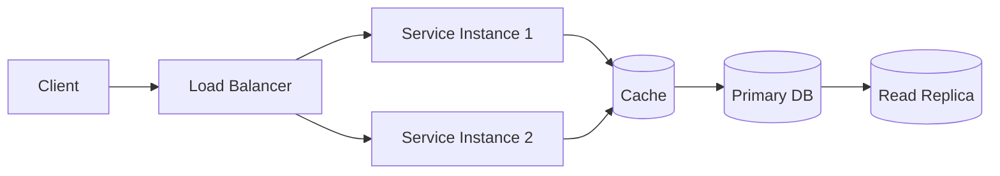

# System Design Learning Log 🧠📐

A personal, evolving repository where I document my system design learning journey — concepts, trade-offs, real-world case studies, and diagrams (all rendered natively in GitHub via Mermaid).

> **Why this repo exists:** to force myself to explain concepts in my own words, keep a searchable diagram archive, and track progress over time instead of losing notes across scattered docs. This repo follows a structured curriculum (below) built specifically for an AI Engineer background — classic system design fundamentals first, then ML/AI-specific patterns where my actual production experience becomes the differentiator.

---

## 📌 How to use this repo

- Each **topic** gets its own folder under `topics/` with a `README.md` (notes) and a `diagrams/` folder if the Mermaid diagrams get large.
- Each **case study** (e.g., "Design Twitter", "Design a Rate Limiter") lives under `case-studies/` with requirements → high-level design → deep dive → trade-offs.
- Diagrams are written in **Mermaid** directly inside markdown so they render on GitHub with zero external tools.
- Progress is tracked in the tables below — updated as topics move from `Not Started` → `In Progress` → `Done`.
- Every case study is practiced **out loud, timed**, using the 5-step framework below — not just read and filed away.

---

## 🗣️ The Answering Framework (use this every time, out loud)

A repeatable structure to avoid freezing on an open-ended prompt. Every case-study note in this repo is organized around these five steps:

1. **Clarify requirements (2-3 min)** — functional (what must it do) and non-functional (scale, latency, consistency needs). Ask questions before designing anything.
2. **Estimate scale (back-of-envelope)** — users, requests/sec, data volume, storage growth. Rough numbers, stated out loud.
3. **High-level design** — draw the major components and how data flows between them, before any detail.
4. **Deep dive** — go deep on the 1-2 components an interviewer would steer toward (this is where AI-specific knowledge becomes the differentiator).
5. **Trade-offs and bottlenecks** — name what I'd reconsider at 10x scale, what could fail, and how I'd detect/recover.

> Practice saying *"I don't know the exact number, but I'd estimate roughly X because Y"* out loud — estimation confidence matters more than precision.

---

## 📂 Repository Structure

```
system-design/
├── README.md                  ← you are here (curriculum + tracker)
├── fundamentals/               ← Module A — classic system design
│   ├── scalability.md
│   ├── availability.md
│   ├── consistency.md
│   ├── cap-theorem.md
│   ├── load-balancing.md
│   ├── caching.md
│   ├── databases-indexing-sharding-replication.md
│   ├── message-queues.md
│   ├── api-design-rest-vs-graphql.md
│   ├── rate-limiting.md
│   └── consistent-hashing.md
├── topics/                     ← Module B — ML/AI-specific patterns
│   ├── model-serving/
│   ├── rag-systems/
│   ├── feature-stores/
│   ├── ab-testing-experimentation/
│   ├── agent-systems/
│   ├── ml-observability-drift/
│   └── data-pipelines-for-ml/
├── case-studies/                ← Module C — full mock-interview writeups
│   ├── classic/
│   │   ├── design-url-shortener.md
│   │   ├── design-rate-limiter.md
│   │   └── design-notification-system.md
│   └── ai-ml/
│       ├── design-rag-fintech-chatbot.md
│       ├── design-fraud-detection-system.md
│       ├── design-model-serving-platform.md
│       ├── design-agentic-compliance-review.md
│       ├── design-recommendation-system.md
│       ├── design-feature-store.md
│       └── design-model-drift-monitoring.md
├── diagrams/                    ← standalone/shared diagrams
└── resources.md                 ← books, courses, links
```

---

## 📊 Progress Tracker

### Module A — Classic System Design Fundamentals (Weeks 1-2)

These underpin every ML system design question, so they get solid first, before layering AI-specific patterns on top.

| Topic | Status | Notes |
|---|---|---|
| Scaling (horizontal vs. vertical, load balancers, stateless services) | ⬜ Not Started | Tie to real Lambda/serverless architecture example |
| Databases (SQL vs. NoSQL, indexing, sharding, replication, read replicas) | ⬜ Not Started | |
| Caching (client/CDN/app/DB layers, invalidation, Redis basics) | ⬜ Not Started | |
| CAP Theorem (consistency vs. availability under partition) | ⬜ Not Started | Practice framing: compliance flag system → consistency; recommendation feed → availability |
| Message Queues (Kafka/SQS-style async decoupling) | ⬜ Not Started | Named gap area — prioritize |
| API Design (REST vs. GraphQL trade-offs) | ⬜ Not Started | Named gap area — prioritize |
| Rate Limiting (token bucket, sliding window) | ⬜ Not Started | Common standalone question |
| Consistent Hashing (distributed caching, sharding) | ⬜ Not Started | Common deep-dive topic |

**Legend:** ⬜ Not Started · 🟨 In Progress · ✅ Done

**Practice for this module:** pick 3 classic prompts (URL shortener, rate limiter, notification system) and run the 5-step framework out loud, timed to ~20 minutes each.

### Module B — ML/AI-Specific System Design Patterns (Weeks 3-4)

This is where real production AI experience becomes a genuine advantage — most system-design candidates don't have this depth. Lean in hard once fundamentals are solid.

| Topic | Status | Notes |
|---|---|---|
| Model Serving Infra (batch vs. real-time, versioning/rollback, autoscaling, GPU vs. CPU) | ⬜ Not Started | Reuse real MLOps answers |
| RAG System Design (ingestion → chunking → embedding → vector store → retrieval → reranking → generation → caching) | ⬜ Not Started | Can speak to every stage already |
| Feature Stores (train/serve skew prevention, online vs. offline) | ⬜ Not Started | |
| A/B Testing / Experimentation (shadow deployment, canary rollout) | ⬜ Not Started | Reuse real MLOps language |
| Agent System Design (orchestration, state management, guardrails, escalation) | ⬜ Not Started | **Strongest differentiator — reuse FinCrime architecture answers directly** |
| ML Monitoring/Observability (drift detection, latency percentiles, model dashboards) | ⬜ Not Started | Overlaps with escalation-rate/override-rate work |
| Data Pipeline Design for ML (batch training, streaming feature updates, backfill) | ⬜ Not Started | |

**Practice for this module:** take 3-4 of the AI/ML mock prompts below and run the same 5-step framework, but explicitly pull in real project experience during the deep-dive step.

### Module C — Full Mock Sessions (~45 min each, out loud, timed)

| # | Prompt | Type | Status | Notes |
|---|---|---|---|---|
| 1 | Design a RAG-based customer support chatbot for a fintech company, serving 100k users | AI/ML | ⬜ Not Started | |
| 2 | Design a real-time fraud/anomaly detection system for financial transactions | AI/ML | ⬜ Not Started | Very close to real FinCrime work — should feel familiar |
| 3 | Design a model-serving platform supporting batch + real-time inference for multiple ML teams | AI/ML | ⬜ Not Started | |
| 4 | Design an agentic system that automates document review for compliance, with human-in-the-loop escalation | AI/ML | ⬜ Not Started | Directly my domain |
| 5 | Design a recommendation system for a content platform | AI/ML | ⬜ Not Started | Classic ML system design — tests Module A + B together |
| 6 | Design a feature store for a company running multiple ML models in production | AI/ML | ⬜ Not Started | |
| 7 | Design a system to detect and monitor model drift across 50+ deployed models | AI/ML | ⬜ Not Started | |
| 8 | Design a URL shortener | Classic | ⬜ Not Started | |
| 9 | Design a rate limiter | Classic | ⬜ Not Started | |
| 10 | Design a notification system | Classic | ⬜ Not Started | |

> If possible, do 2-3 of these with a friend or mock-interview partner playing interviewer — the real skill being tested is communicating thinking under ambiguity, not just having the answer.

---

## 🖼️ Diagram Convention

All diagrams use [Mermaid](https://mermaid.js.org/) so they render directly on GitHub. Example convention used throughout this repo:



**Rules I follow for consistency:**
- `flowchart LR` for request flows, `sequenceDiagram` for interaction/timing, `erDiagram` for data models.
- Databases and caches always shown as cylinders `[(...)]`.
- Every case-study diagram is preceded by a one-line caption describing what it shows.

---

## 📝 Note Template — Fundamentals & Topics

```markdown
## What problem does this solve?

## Key concepts

## Trade-offs
| Approach | Pros | Cons |
|---|---|---|

## Real-world examples

## Diagram

## Interview angle (questions this could show up in)
```

## 📝 Note Template — Case Studies (5-step framework)

```markdown
## 1. Clarify Requirements
### Functional
### Non-functional (scale, latency, consistency)

## 2. Back-of-Envelope Estimation
- Users / requests per second
- Data volume & storage growth

## 3. High-Level Design
(diagram + component list)

## 4. Deep Dive
(the 1-2 components explored in depth — pull in real project experience here)

## 5. Trade-offs & Bottlenecks
- What breaks at 10x scale?
- What could fail, and how would I detect/recover?

## Real project tie-in
(where relevant: link this design to actual production work — FinCrime agents, RAG email app, MLOps pipelines, etc.)
```

---

## 📚 Resources

- *Designing Data-Intensive Applications* — Martin Kleppmann
- *System Design Interview* Vol 1 & 2 — Alex Xu
- [High Scalability blog](http://highscalability.com/)
- Engineering blogs: Uber, Netflix, Airbnb, Discord, Meta
- [ByteByteGo](https://bytebytego.com/)

---

## 🎯 Goals

- [ ] Complete Module A (classic fundamentals) — Weeks 1-2
- [ ] Complete Module B (ML/AI-specific patterns) — Weeks 3-4
- [ ] Complete all 10 Module C mock sessions, timed and out loud
- [ ] Run at least 2-3 mock sessions with a partner playing interviewer
- [ ] Revisit and refine older notes as understanding deepens
- [ ] Use this repo actively during interview prep

---

*Last updated: Aug 19, 2026*
